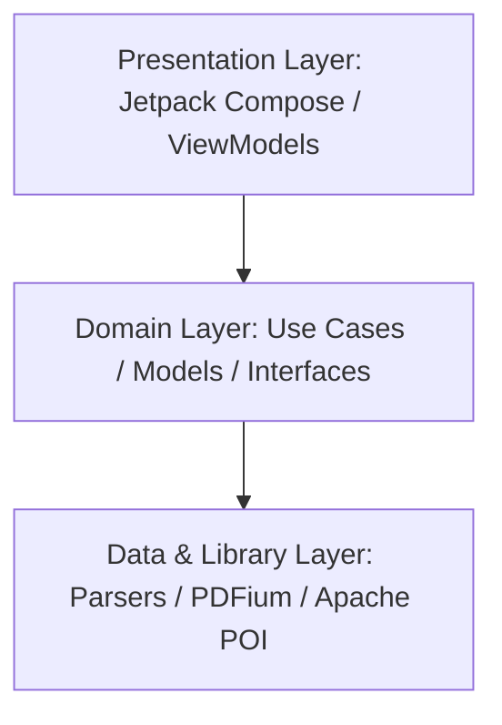
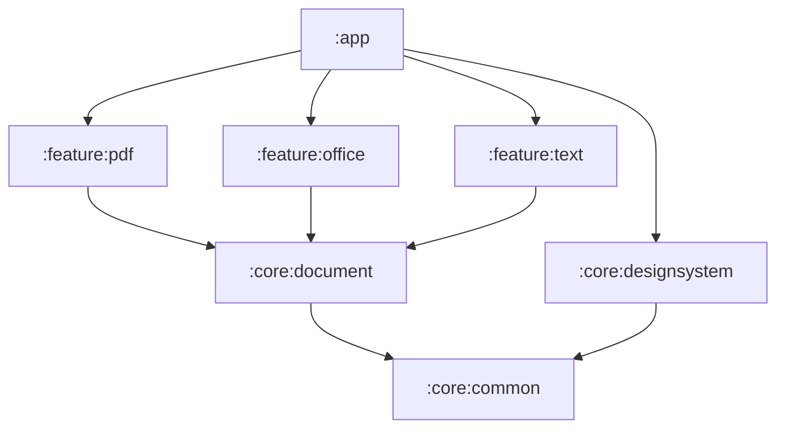
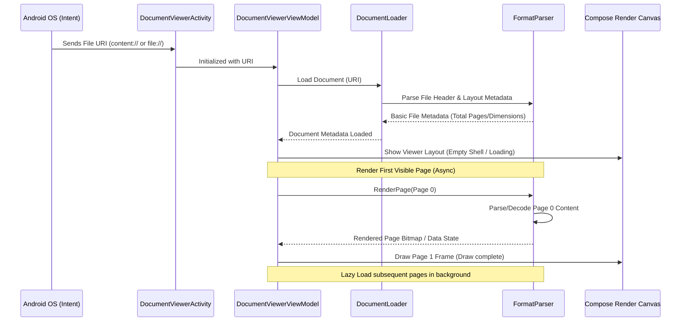
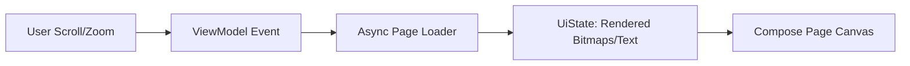

# Blink Architecture

Blink utilizes a highly optimized, modular **Clean Architecture** combined with **Unidirectional Data Flow (UDF)**. 

To meet the strict performance target of `< 500ms` cold start, the app avoids typical heavy framework dependencies (e.g., Dagger Hilt or Room) in favor of manual constructor dependency injection and raw Kotlin Coroutines/Flow streams.

---

## High-Level Architecture

The project is structured around three primary layers to maintain separation of concerns:

1. **Presentation Layer**: Built completely on Jetpack Compose and ViewModels. It consumes UI States and emits User Intents.
2. **Domain Layer**: Defines the core business logic, including document loading abstractions, generic page models, and use cases. This layer contains no framework-specific or format-specific code.
3. **Data & Library Layer**: Implementation of document parsing engines. This is where file input streams are consumed, PDFium is utilized for native rendering, and Apache POI is invoked to parse Office spreadsheets and slides.

---

## Module Boundaries

The project is split into several Gradle modules to ensure clear separation of concerns, improve build times, and prevent dependency leakages:

* **`:app`**: Application entry point. Houses the main document launcher activity, dependency graph configuration, and main viewer screen composables.
* **`:core:common`**: Contains utilities, base extensions, and core Coroutine dispatcher abstractions.
* **`:core:designsystem`**: Theme files (colors, typography, shapes) and reusable Compose UI components.
* **`:core:document`**: Defines unified models (`Document`, `Page`, `RenderResult`) and interfaces (`DocumentParser`, `PageRenderer`) to abstract away formatting details.
* **`:feature:pdf`**: Implementations using PDFium to render PDF pages into bitmaps.
* **`:feature:office`**: Implementations using Apache POI to parse Word (.doc, .docx), Excel (.xls, .xlsx), and PowerPoint (.ppt, .pptx).
* **`:feature:text`**: Custom lightweight parsers for plaintext (.txt) and tabular CSV data.

---

## Document Opening Flow

To open a document in under `300ms`, Blink implements a lazy initialization pipeline. The app starts rendering the first page before the rest of the document is parsed.

1. **Intent Capture**: The system launches the viewer activity with a file URI.
2. **Metadata Load**: The parser quickly opens the file descriptor and reads *only* headers or table of contents (e.g., page count, sheet names) to build layout boundaries.
3. **First-Frame Draw**: The parser renders *only* the first visible page or initial rows.
4. **Lazy Parsing**: Additional pages/content are parsed only as the user scrolls, minimizing memory usage.

---

## Data Flow (UDF)

Within a feature module, state flows in a single direction to prevent side effects:

1. **User Action**: User scrolls, requesting page $N$.
2. **Request Dispatch**: The View notifies the `ViewModel`.
3. **Async Generation**: The `ViewModel` dispatches an asynchronous job to the respective `PageRenderer` on `Dispatchers.Default`.
4. **LruCache Check**: The renderer checks if page $N$ already exists in the memory `LruCache`. If not, it parses and renders the page.
5. **State Update**: The rendered result is pushed into a `MutableStateFlow`.
6. **Recomposition**: Compose UI observes the flow, receives the updated state, and draws the frame.

---

## Rendering Flow

* **PDF / PowerPoint**: Rendered page-by-page as scaled bitmaps on a scrollable canvas. Page resizing uses hardware-accelerated rendering inside Canvas paths.
* **Word / Text**: Parsed into raw text fragments and structured elements (headings, paragraphs, lists) and rendered dynamically using Compose's `LazyColumn` for high performance.
* **Excel / CSV**: Rendered using a customized, virtualized 2D grid component. Cells are only computed and composed when they enter the viewport.
* **Memory Management**: Rendered page bitmaps are held in a bounded `LruCache` sizing dynamic to available device heap memory to prevent `OutOfMemoryError` issues when scrolling large files.
