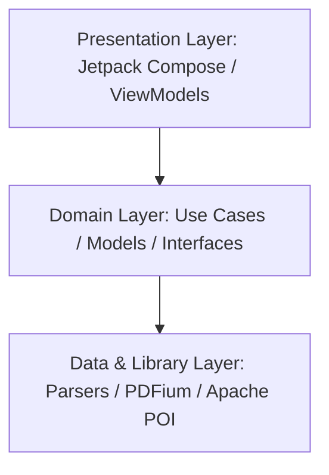
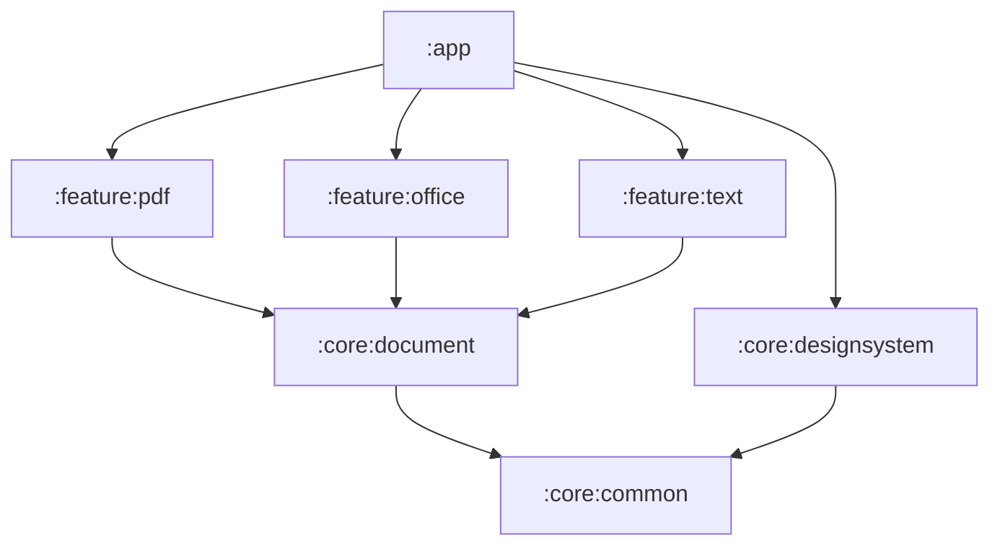
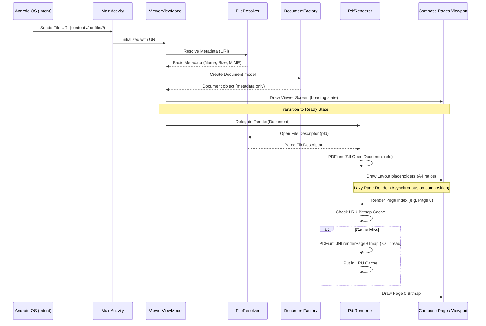
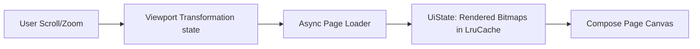

# Blink Architecture

Blink utilizes a highly optimized, modular **Clean Architecture** combined with **Unidirectional Data Flow (UDF)**. 

To meet the strict performance target of `< 500ms` cold start, the app avoids typical heavy framework dependencies (e.g., Dagger Hilt or Room) in favor of manual constructor dependency injection and raw Kotlin Coroutines/Flow streams.

---

## High-Level Architecture

The project is structured around three primary layers to maintain separation of concerns:

1. **Presentation Layer**: Built completely on Jetpack Compose and ViewModels. It consumes UI States and emits User Intents.
2. **Domain Layer**: Defines the core business logic, including document loading abstractions, generic page models, and use cases. This layer contains no framework-specific or format-specific code.
3. **Data & Library Layer**: Implementation of document parsing engines. This is where file input streams are consumed, PDFium is utilized for native rendering, and Apache POI is invoked to parse Office spreadsheets and slides.

---

## Module Boundaries

The project is split into several Gradle modules to ensure clear separation of concerns, improve build times, and prevent dependency leakages:

* **`:app`**: Application entry point. Houses the main document launcher activity, manual DI graph configuration, and main navigation wiring.
* **`:core:common`**: Contains logging utilities, Dispatchers injectors, base extensions, and the unified `AppError` sealed model.
* **`:core:designsystem`**: Reusable typography, dimension scales, colors, shape systems, and shared widgets.
* **`:core:ui`**: Defines Compose-aware rendering contracts (`ComposableDocumentRenderer`) to decouple Compose logic from the domain layer.
* **`:domain`**: Houses core business models (`Document`, `DocumentMetadata`, `DocumentType`, `DocumentState`) and core contracts (`DocumentViewer`, `DocumentRenderer`, `DocumentFactory`, `FileResolver`).
* **`:feature:pdf`**: Implements native PDF JNI rendering using PDFium, wrapping asynchronous off-thread page decodes in the `PdfViewer` Composable.
* **`:feature:office`**: Implementations using Apache POI to parse Word (.doc, .docx), Excel (.xls, .xlsx), and PowerPoint (.ppt, .pptx).
* **`:feature:text`**: Custom lightweight parsers for plaintext (.txt) and tabular CSV data.
* **`:feature:viewer`**: Houses the format-agnostic viewer state machine, `ViewerViewModel`, and the root `ViewerScreen` routing display to the resolved renderer.

---

## Document Opening Flow

To open a document in under `300ms`, Blink implements a lazy initialization pipeline. The app starts rendering the first page before the rest of the document is parsed.

1. **Intent Capture**: The system launches `MainActivity` with a file URI.
2. **Metadata Load**: `FileResolver` opens the URI and queries display name and size using activity content resolver contexts and taking persistable permissions.
3. **Document model construction**: `DocumentFactory` determines `DocumentType` based on extension first (falling back to MIME type) and constructs the model.
4. **Renderer Delegation**: `ViewerScreen` matches `DocumentType.PDF` to `PdfRenderer` using constructor-injected lists and delegates layout composition to the renderer's `Render()` function.
5. **PDFium Initialization**: The PDF renderer retrieves a `ParcelFileDescriptor` off-thread and initializes native PDFium JNI document handles, loading page sizes immediately to render correct layout placeholders.
6. **Lazy page rendering**: Each page item in the `LazyColumn` requests its bitmap from the renderer as it enters the viewport. The renderer decodes the page on `Dispatchers.IO` and caches it inside an LRU Cache to guarantee 60 FPS scrolling.

---

## Data Flow (UDF)

Within a feature module, state flows in a single direction to prevent side effects:

1. **User Action**: User scrolls, bringing page $N$ into composition viewport.
2. **Request Dispatch**: Composable requests the page bitmap.
3. **Async Generation**: If not in LruCache, the bitmap is allocated and rendered off-thread.
4. **State Update**: The bitmap state is updated, triggering recomposition of the page block.
5. **Recomposition**: Compose draws the bitmap to the page canvas.

---

## Rendering Flow

* **PDF / PowerPoint**: Rendered page-by-page as scaled bitmaps on a scrollable canvas. Page rendering is deferred until visible. Rendered page bitmaps are held in a bounded `LruCache` capped at 6 pages to stay safely below heap memory constraints.
* **Word / Text**: Parsed into raw text fragments and structured elements (headings, paragraphs, lists) and rendered dynamically using Compose's `LazyColumn` for high performance.
* **Excel / CSV**: Rendered using a customized, virtualized 2D grid component. Cells are only computed and composed when they enter the viewport.

